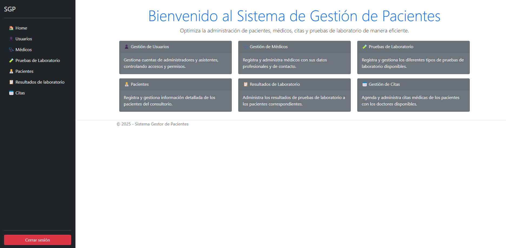

# Patient Management System

This project is a Patient Management System developed with **ASP.NET Core MVC** (.NET 8) following the **Onion Architecture** pattern.

## 📖 About the Project

The Patient Management System is designed to manage the different operations of a healthcare clinic, offering features such as:

- **Login and Registration**: Secure login and registration of administrator users.
- **User Management (Admin only)**: Create, edit, and delete system users (Admin or Assistant).
- **Doctor Management (Admin only)**: Manage doctor profiles with details and photos.
- **Laboratory Tests Management (Admin only)**: Create, edit, and delete lab tests.
- **Patient Management (Assistant only)**: Register and manage patients' data.
- **Lab Results Management (Assistant only)**: Report lab results and manage pending results.
- **Appointments Management (Assistant only)**: Schedule, consult, and complete patient appointments.

## 🖥️ Technologies Used

### Frontend
- HTML
- CSS
- Bootstrap
- ASP.NET Razor Pages

### Backend
- C# with ASP.NET Core MVC 8
- Microsoft Entity Framework Core
- Microsoft Entity Framework Core SQL Server
- Microsoft Entity Framework Core Tools
- Microsoft Entity Framework Core Design
- Entity Framework Code First

### Architecture
- Onion Architecture (100% properly applied)
- Generic Repository and Service Pattern

### ORM
- Entity Framework

### Database
- SQL Server

## 📸 Project Image

### Home Menu



## 📋 Prerequisites

Before running the Patient Management System, make sure you have the following installed:

- Visual Studio 2022 or later
- ASP.NET Core 8
- SQL Server (local or remote)

## 🚀 Installation

1. **Download** the project or clone it.
   
2. **Open** the project in Visual Studio 2022.

3. **Configure** the database connection:
   - Open the `appsettings.Development.json` file.
   - Update the `Server` name to match your local environment, for example:

     ```json
     {
       "ConnectionStrings": {
         "DefaultConnection": "Server=YourServerName;"
       }
       // other configurations...
     }
     ```

4. In Visual Studio, go to:

   - **Tools > NuGet Package Manager > Package Manager Console**

5. In the **Package Manager Console**:
   - Make sure the Web Application project is selected as the **Default Project**.
   - You can select it from the dropdown menu in the Package Manager Console.

6. In the console, run the following command:

   ```bash
   Update-Database

7. Run the project:
    - Press F5 or click the Run button.
    -The application will launch automatically in your default web browser.